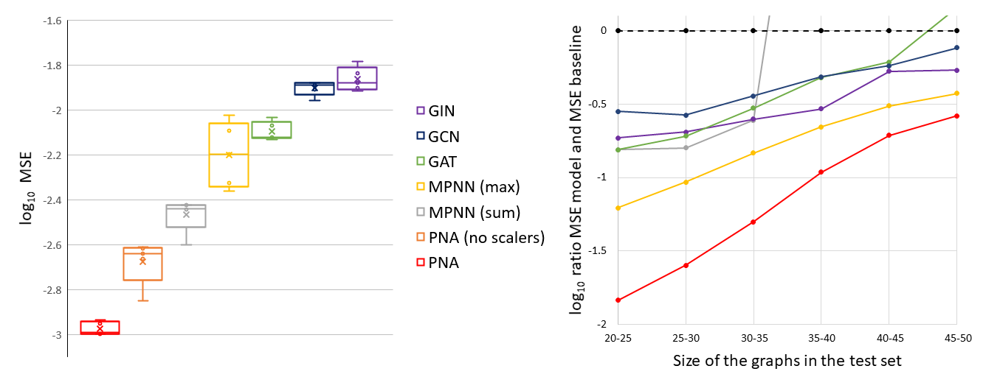
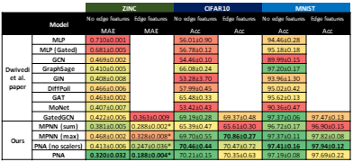

# Principal Neighbourhood Aggregation

Principal Neighbourhood Aggregation for Graph Nets [arxiv.org/abs/2004.05718](https://arxiv.org/abs/2004.05718)

## Overview

We provide the implementation of the Principal Neighbourhood Aggregation (PNA) in both PyTorch and DGL frameworks, along with scripts to generate and run the multitask benchmarks, scripts for running real-world benchmarks, a flexible PyTorch GNN framework and implementations of the other models used for comparison. The repository is organised as follows:

- `models` contains:
  - `pytorch` contains the various GNN models implemented in PyTorch:
    - the implementation of the aggregators, the scalers and the PNA layer (`pna`)
    - the flexible GNN framework that can be used with any type of graph convolutions (`gnn_framework.py`)
    - implementations of the other GNN models used for comparison in the paper, namely GCN, GAT, GIN and MPNN
  - `dgl` contains the PNA model implemented via the [DGL library](https://www.dgl.ai/): PNA tower and layer, aggregators, scalers and readout.
  - `layers.py` contains general NN layers used by the various models
- `multi_task` contains various scripts to recreate the multi_task benchmark along with the files used to train the various models. In `multi_task/README.md` we detail the instructions for the generation and training hyperparameters tuned.
- `real_world` contains various scripts from [Benchmarking GNNs](https://github.com/graphdeeplearning/benchmarking-gnns) to download the real-world benchmarks and train the PNA on them. In `real_world/README.md` we provide instructions for the generation and training hyperparameters tuned.





## Reference
```
@article{corso2020principal,
  title={Principal Neighbourhood Aggregation for Graph Nets},
  author={Corso, Gabriele and Cavalleri, Luca and Beaini, Dominique and Lio, Pietro and Velickovic, Petar},
  journal={arXiv preprint arXiv:2004.05718},
  year={2020}
}
```

## License
MIT
