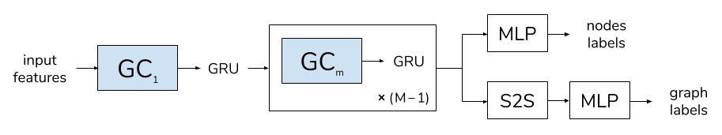

# Principal Neighbourhood Aggregation

Principal Neighbourhood Aggregation for Graph Nets [https://arxiv.org/abs/2004.05718](https://arxiv.org/abs/2004.05718)

## Overview

We provide the implementation of the Principal Neighbourhood Aggregation (PNA) in both PyTorch and DGL frameworks, along with scripts to generate and run the multitask benchmarks, scripts for running real-world benchmarks, a flexible PyTorch GNN framework and implementations of the other models used for comparison. The repository is organised as follows:

- `models/` contains:
  - `/pytorch/` contains:
    - the implementation of the aggregators, the scalers and the PNA layer (`/pna/`)
    - the flexible GNN framework that can be used with any type of graph convolutions (`gnn_framework.py`)
    - implementations of the other GNN models used for comparison in the paper, namely GCN, GAT, GIN and MPNN
  - `/dgl/` TODO:
    - `/layers/` contains: TODO:
  - general NN layers used by the various models (`layers.py`) 


The model specified by the arguments above uses the same architecture (represented in the image below) and the same aggregators and scalers as used for the results in the paper. Note that the default hyper-parameters are not the best performing for every model, refer to the paper for details on how we set them.




## Reference
```
@article{corso2020principal,
  title={Principal Neighbourhood Aggregation for Graph Nets},
  author={Corso, Gabriele and Cavalleri, Luca and Beaini, Dominique and Lio, Pietro and Velickovic, Petar},
  journal={arXiv preprint arXiv:2004.05718},
  year={2020}
}
```

## License
MIT
